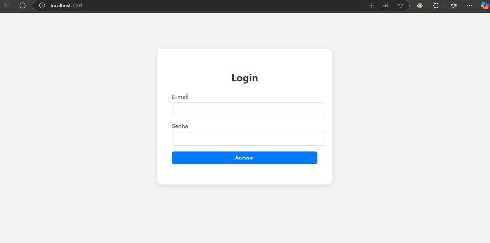

# Login App

Uma aplicação simples de login feita com **React**, com design moderno e minimalista. Desenvolvida para treinar conceitos de componentes, estado e eventos em React.

---

## 🚀 Tecnologias usadas

- React
- JavaScript
- HTML5 e CSS3
- VS Code

---

## 📷 Tela de Login

